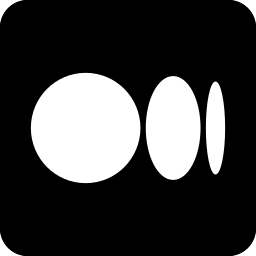

### Hi hackers!

  
  
  

 

 
  
 
    
    <h1 align="center">My favorite technologies <3</h1>
    
    
    
    

   

    
  
  <h1 align="center">social media</h1>
    <a href = "https://linktr.ee/gutierre0x80">
      
    
    
    
    
    </a>
    

  

